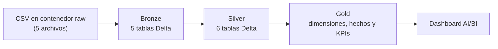
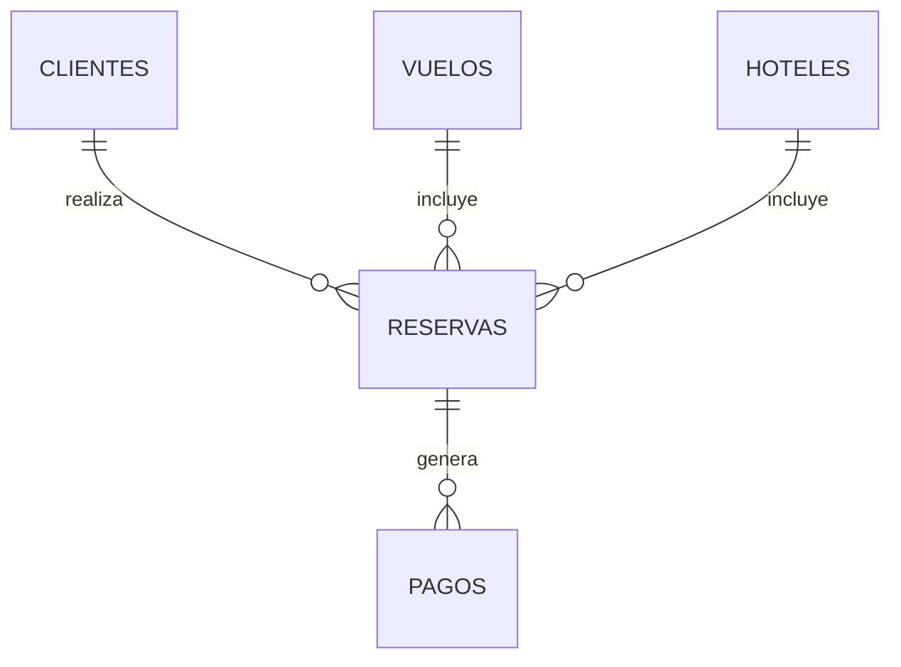
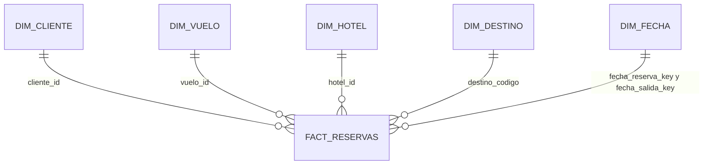

# Agencia de Viajes: Lakehouse con arquitectura medallón en Azure Databricks

Proyecto de ingeniería de datos que construye un Lakehouse para una agencia de viajes. Toma los datos de clientes, hoteles, vuelos, reservas y pagos, los procesa en tres capas (Bronze, Silver y Gold) y los deja listos para análisis en un dashboard de ventas.

## Objetivo

Responder preguntas de negocio de la agencia, por ejemplo:

- ¿Cuánto vendemos por mes y cuánto de eso ya se cobró?
- ¿Qué destinos, hoteles y aerolíneas generan más ingresos?
- ¿Qué segmentos de clientes gastan más y cuál es su ticket promedio?
- ¿Qué rutas y jornadas de vuelo son las más reservadas?

## Tecnologías

| Componente | Uso |
|---|---|
| Azure Databricks | Procesamiento y orquestación de notebooks |
| Delta Lake | Formato de todas las tablas |
| Unity Catalog | Catálogo, esquemas, external locations y permisos |
| Azure Data Lake Storage Gen2 | Almacenamiento (un contenedor por capa) |
| PySpark y Spark SQL | Transformaciones y DDL |
| AI/BI Dashboards (Lakeview) | Visualización de los KPIs |

## Arquitectura



Todo vive en un catálogo de Unity Catalog (`catalog_dev` por defecto) con los esquemas `raw`, `bronze`, `silver` y `golden`. Cada capa tiene su propio contenedor en ADLS y su propia external location (`exlt-raw`, `exlt-bronze`, `exlt-silver`, `exlt-golden` y `exlt-metastore`). Las tablas son externas: los archivos Delta quedan en el contenedor de su capa.

## Datos fuente

Cinco archivos CSV relacionados entre sí:



| Archivo | Llave | Contenido |
|---|---|---|
| `clientes.csv` | `cliente_id` | Datos del cliente, ciudad, segmento (Premium, Standard, Frecuente) |
| `hoteles.csv` | `hotel_id` | Hotel, destino, estrellas, régimen, precio por noche, calificación |
| `vuelos.csv` | `vuelo_id` | Aerolínea, origen, destino, fechas y horas, precio, equipaje, estatus |
| `reservas.csv` | `id_reserva` | Reserva de tipo Paquete, Hotel o Vuelo, con montos, descuento y estado |
| `pagos.csv` | `id_pago` | Anticipos, liquidaciones y pagos totales por reserva |

Reglas de consistencia del dataset:

- Una reserva tipo Vuelo no tiene hotel y una tipo Hotel no tiene vuelo; las de tipo Paquete tienen ambos.
- El destino y la fecha de salida de la reserva coinciden con los de su vuelo y su hotel.
- El orden de fechas es: registro del cliente, reserva, salida y regreso.
- En las reservas completadas, la suma de pagos aprobados es igual al monto total.

Los datos son sintéticos y se generan con `datos_medallon/generar_datos.py`. Por defecto incluyen defectos leves y controlados (duplicados, nulos, espacios y mayúsculas) para practicar la limpieza de Bronze a Silver. Con `INYECTAR_DEFECTOS = False` se obtienen datos limpios.

## Capas del modelo

### Bronze: datos crudos

Una tabla por archivo (`clientes`, `hoteles`, `vuelos`, `reservas`, `pagos`) con el esquema tipado de la fuente y sin transformaciones de negocio.

### Silver: datos limpios y enriquecidos

Las mismas cinco tablas, depuradas y con columnas derivadas, más una tabla que une todo:

| Tabla | Columnas agregadas |
|---|---|
| `clientes` | `nombre_completo`, `calidad_registro` |
| `hoteles` | `nivel_calificacion` |
| `vuelos` | `ruta`, `duracion_minutos`, `calidad_precio`, `jornada` |
| `reservas` | `numero_noches`, `monto_por_persona`, `validacion_fechas` |
| `pagos` | `calidad_pago` |
| `reservas_enriquecidas` | Reserva unida con cliente, vuelo, hotel y pago en una sola tabla |

### Gold: modelo dimensional y KPIs

Un esquema en estrella para análisis:



Sobre ese modelo se calculan cinco tablas de KPIs que alimentan el dashboard:

| Tabla KPI | Qué mide |
|---|---|
| `kpi_ventas_mensuales` | Reservas, viajeros, ventas, ticket promedio, gasto por persona y pagos recibidos por mes |
| `kpi_destinos` | Ventas, ticket, noches promedio y descuento promedio por destino |
| `kpi_clientes` | Gasto total, ticket y fechas de primera y última reserva por cliente |
| `kpi_hoteles` | Ventas, huéspedes, precio por noche y calificación por hotel |
| `kpi_vuelos` | Reservas, pasajeros, precio y duración por aerolínea, ruta y jornada |

## Dashboard

`dashboard/kpis_viajes.lvdash.json` es un dashboard AI/BI de cinco páginas (Ventas mensuales, Destinos, Clientes, Hoteles y Vuelos), con indicadores, gráficos y tablas de detalle sobre las tablas `kpi_*`. Se regenera con `dashboard/generar_dashboard.py`.

## Estructura del repositorio

```text
.
├── 1-Preparacion_Ambiente.py        # External locations, catálogo, esquemas y tablas DDL
├── datos_medallon/
│   ├── clientes.csv, hoteles.csv, vuelos.csv, reservas.csv, pagos.csv
│   ├── generar_datos.py             # Generador de datos sintéticos relacionados
│   └── README.md                    # Reglas del dataset
├── dashboard/
│   ├── kpis_viajes.lvdash.json      # Dashboard AI/BI
│   └── generar_dashboard.py
├── seguridad/
│   ├── grants.py                    # Otorga permisos de lectura a 2 usuarios
│   ├── revoke.py                    # Retira esos permisos
│   └── drop_table.py                # Elimina todos los objetos del ambiente
└── (notebooks de transformación Bronze, Silver y Gold)
```

## Cómo ejecutarlo

1. **Datos:** genera los CSV con `datos_medallon/generar_datos.py` (o usa los incluidos) y cárgalos en el contenedor `raw` de tu cuenta de ADLS.
2. **Ambiente:** ejecuta `1-Preparacion_Ambiente.py`. Crea las external locations, el catálogo, los esquemas y las tablas de las tres capas.
3. **Transformaciones:** ejecuta los notebooks de Bronze, Silver y Gold en ese orden.
4. **Dashboard:** en Databricks ve a Dashboards, importa `kpis_viajes.lvdash.json` y asígnale un SQL warehouse. Antes, reemplaza `mi_catalogo.golden` por tu catálogo y esquema Gold.
5. **Permisos:** ejecuta `seguridad/grants.py` con los correos de los usuarios que deben consultar los datos.

### Parámetros (widgets)

| Widget | Valor por defecto | Descripción |
|---|---|---|
| `catalog` | `catalog_dev` | Catálogo de Unity Catalog |
| `container_raw` | `raw` | Contenedor y esquema de datos fuente |
| `container_metastore` | `metastore` | Contenedor para la ubicación administrada del catálogo |
| `schema_bronze`, `schema_silver`, `schema_golden` | `bronze`, `silver`, `golden` | Esquemas y contenedores de cada capa |
| `storageName` | `<tu_storage_account>` | Cuenta de almacenamiento ADLS Gen2 |

## Seguridad

- Los permisos se manejan con Unity Catalog: `grants.py` otorga `USE CATALOG` en el catálogo y `USE SCHEMA` más `SELECT` en bronze, silver y golden (solo lectura).
- `revoke.py` retira exactamente esos permisos.
- Los correos de los usuarios se capturan en los widgets `usuario_1` y `usuario_2`.

## Limpieza del ambiente

`seguridad/drop_table.py` elimina tablas, archivos de las capas en ADLS, esquemas, catálogo y external locations. Es destructivo: solo se ejecuta si el widget `confirmar` está en `SI`. No borra los contenedores `raw` ni `metastore`.

## Autor

<Joan Carlo Torres Flores>